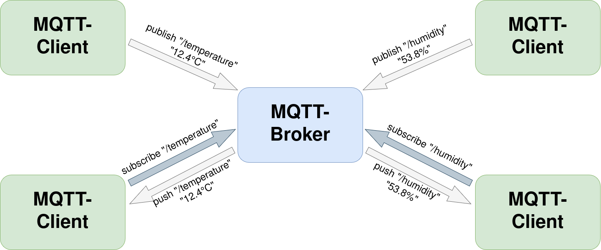

# mqtt-traffic-simulation

Python scripts to generate MQTT traffic using the Python library Scapy.

### Script files

- `mqtt-pcap-generator.py` : generates legitimate MQTT traffic.
  - output : `mqtt_sensor_traffic.pcap`

- `malicious-mqtt-pcap-generator.py` : generates malicious MQTT traffic that simulates data exfiltration attacks.
  - output : `mqtt_exfiltration.pcap`

- `mixed-mqtt-pcap-generator.py` : generates MQTT traffic that contains both legitimate and malicious packets.
  - output : `mqtt_mixed_traffic.pcap`
